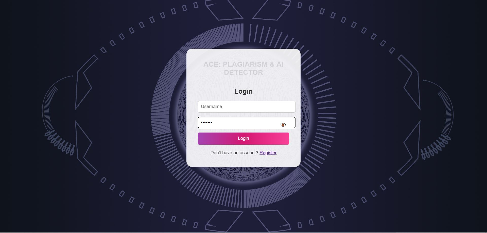
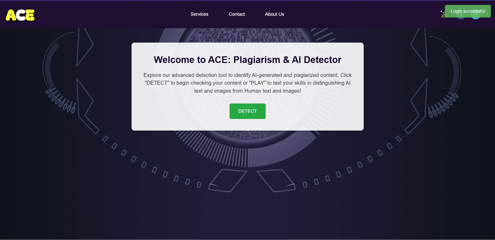
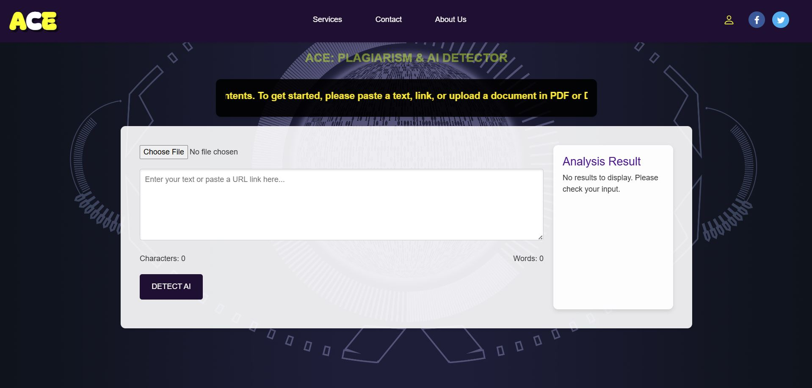
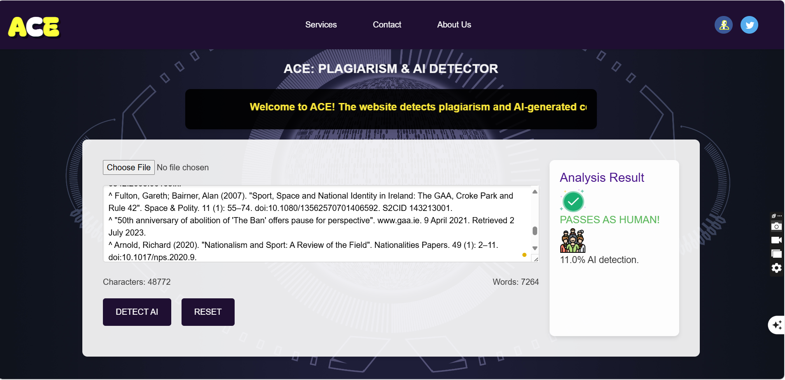
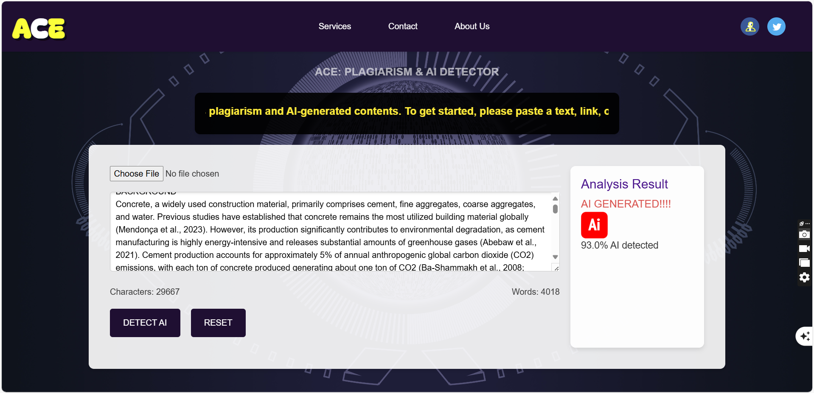

# 🧠 ACE - AI Text Detector

**ACE AI Detector** is a smart web app that detects whether any text is **AI-generated** or **human-written** using a custom-trained ML pipeline. You can paste text, upload documents, or extract content from URLs — and get instant results with probability scoring.

##
🔐 Login Credentials:

Username: ace

Password: ace

👉 Please sign in using the credentials above. Do not register a new account.

##

🌐 **Live Demo**:  
👉 [ace-ai-detector-xkv7.onrender.com](https://ace-ai-detector-xkv7.onrender.com/)

---

## 🚀 Features

- 🔍 **AI Text Detection** – Classifies text using a trained ML model (`pipeline_model.pkl`)
- 📄 **PDF & Word Upload** – Analyze DOCX/PDF files for AI content
- 🌐 **URL Analysis** – Extracts and scans website text
- 🔐 **User Authentication** – Secure login and registration
- 📊 **Confidence Scoring** – Displays probability with `AI` or `Human` label

---

## 🖼️ Screenshots

##

Preview of ACE from login to Dashboard:

---

## 🧠 Tech Stack

| Layer       | Tools |
|-------------|-------|
| **Framework** | Flask (Python) |
| **ML**         | scikit-learn, joblib |
| **Text Parsing** | PyPDF2, python-docx, BeautifulSoup4 |
| **Auth & DB** | Flask-Login, SQLAlchemy |
| **Frontend**  | HTML, CSS (Bootstrap), JS |

---

**👤 Authors**
**👨‍💻 Co-Developer:** Adu Oluwanifesimi Ayomide (me)
**🤝 Partnered with:** Aliyu Hakeem Tosin
**📧 Email:** aduayomide5@gmail.com
**💻 GitHub:** TechAI-Innovator

